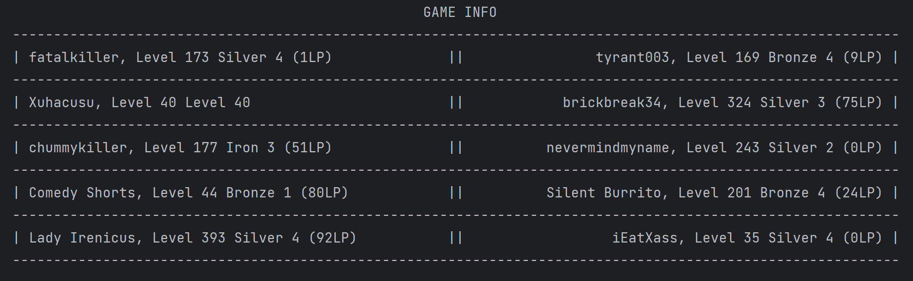

# LOL-matchmaking-scraper



A python web-scraping script that takes data from OP.GG. 

### Install dependencies
```sh
pip/conda install selenium 
```

### Clone repository

```sh
git clone <https://github.com/AndyJLi0/LOL-matchmaking-scraper.git>
```

### Change name
```sh
main("NAME", "REGION")
```
### Run 

```sh
python main.py
```
